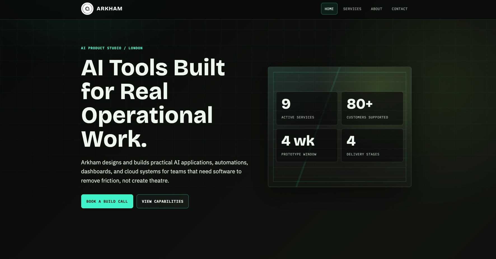

# Arkham Web

## Introduction

Arkham Web is a static website for a fictitious company named Arkham, an AI product studio.

It is built for a small studio or personal brand that needs a clear public website, a practical service catalogue, and a simple contact.



## Features

- Responsive public pages for home, services, about, and contact.
- Service catalogue covering AI applications, automation, business intelligence, cloud migration, edge computing, and batch workloads.
- Contact enquiry form with browser-side validation and server-side validation.
- Docker-ready Node.js server for static hosting and the `/api/contact` endpoint.

## Stack

- Runtime: Node.js with npm.
- Server: Express.
- Frontend: HTML, CSS, and vanilla JavaScript.
- Styling: custom CSS with Bootstrap and Font Awesome assets.
- Storage: local JSON file at `data/contact_submissions.json` for contact submissions.
- Docker and Docker Compose.
- GitHub Actions.
- Azure App Service for Containers using Azure Container Registry.

## Requirements

Before running this project, install:

- Node.js 18 or newer.
- npm.
- Docker and Docker Compose, for container testing or server deployment.
- An Azure subscription with App Service for Containers and Azure Container Registry, for production deployment.

## Test Locally

1. Install dependencies:

    ```bash
    npm install
    ```

2. Start the site:

    ```bash
    npm start
    ```

3. Open `http://127.0.0.1:3000`.

4. Before handing off changes, run:

    ```bash
    node --check server.js
    npm test
    ```

## Test Locally Using Docker

Docker is useful for checking the container before server deployment. The local Compose file builds the image from this repository, publishes the app on `127.0.0.1:3000` by default, and stores contact submissions in the local `./data` folder.

1. Start the local Docker stack:

    ```bash
    docker compose up --build
    ```

    The app will be available at `http://127.0.0.1:3000`.

    To use a different local port, run with `ARKHAM_WEB_PORT`, for example:

    ```bash
    ARKHAM_WEB_PORT=8080 docker compose up --build
    ```

2. Stop the stack:

    ```bash
    docker compose down
    ```

## Server Deployment

You can run this on your own server by building the image.

Use the structure that fits your own environment and preferred deployment methods. For public-facing access, put the service behind HTTPS using a reverse proxy such as Nginx Proxy Manager, Caddy, Traefik, or another preferred option.

My current production target is Azure App Service for Containers. Images are published to Azure Container Registry.

For Azure App Service deployment:

1. Create or open the Azure Web App for Containers.
2. Configure the Web App to use the `arkham` Azure Container Registry.
3. Configure the main site container:

    ```text
    Container name: main
    Image: arkham-web
    Tag: latest, or a deployed commit SHA
    Port: 3000
    Startup command: leave blank
    ```

4. Assign the Web App managed identity the `AcrPull` role on the `arkham` registry.
5. Add production application settings in the Web App:

    ```text
    PORT=3000
    BASE_URL=https://example.com
    ALLOWED_ORIGINS=https://example.com
    ```

6. Deploy through GitHub Actions after CI passes on `main`.
7. Verify the public URL after deployment.

After deployment, verify:

- The public homepage loads.
- The services, about, and contact pages load.
- Invalid contact forms show validation errors.
- Valid contact forms are saved to `data/contact_submissions.json`.

## GitHub Actions

- `CI` runs on pull requests, pushes to `main`, and manual dispatch.
- CI installs dependencies, checks `server.js`, runs `npm test`, and builds the Docker image.
- `Deploy to Azure` runs after `CI` succeeds on `main`, or by manual dispatch.
- CD logs in to Azure using OpenID Connect, pushes `latest` and commit SHA image tags to `arkham.azurecr.io`, updates the App Service `main` site container, sets `PORT=3000`, and restarts the Web App.
- Deployment credentials should be stored in GitHub Actions secrets, not committed to the repository.
- Production runtime values should live in Azure App Service application settings, not in workflow files.

Required GitHub Actions secrets:

```text
AZURE_CLIENT_ID
AZURE_TENANT_ID
AZURE_SUBSCRIPTION_ID
```

Required GitHub Actions variables:

```text
AZURE_WEBAPP_NAME
AZURE_RESOURCE_GROUP
```

The GitHub Actions Azure identity needs `AcrPush` on the `arkham` registry and permission to update the Web App, such as `Website Contributor`. The Web App managed identity needs `AcrPull` on the `arkham` registry so Azure can pull the image at runtime.

## Security Notes

- Do not commit `data/contact_submissions.json` or other local contact submissions.
- Store production secrets in the deployment environment or GitHub Actions secrets, not in the repository.
- Use GitHub Actions OpenID Connect for Azure deployment instead of storing Azure client secrets.
- Restrict `ALLOWED_ORIGINS` in production to the public site origin.
- Public visitors should only see content that is intended to be public.

## AI-Assisted Development

Arkham Web was built with **OpenAI Codex using GPT-5.5**. This repository includes an [`AGENTS.md`](./AGENTS.md) file, which provides structured instructions and context for AI coding agents. It defines expectations, constraints, and project-specific guidance to help keep contributions consistent and reliable.

## Contributions

Contributions, ideas, and suggestions are welcome.

If you have improvements, feature ideas, or bug fixes, feel free to open an issue or submit a pull request. All contributions are appreciated and help improve the project.

## License

This project is licensed under the MIT License. See [LICENSE](./LICENSE) for details.
